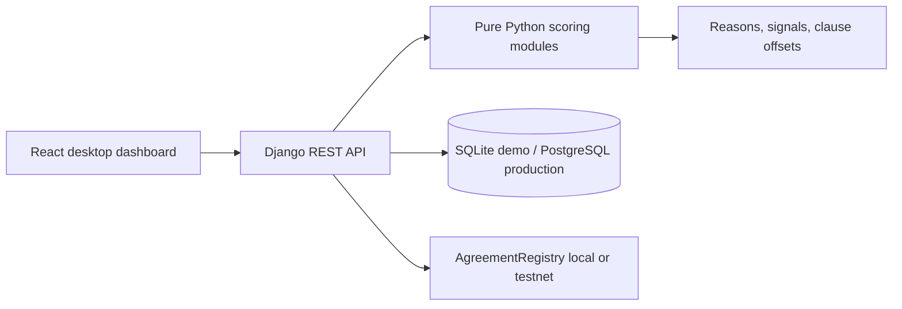

# Architecture

The local demo intentionally keeps scoring deterministic and offline. Production adapters can replace the SQLite store, object storage, identity verifier, transformer models, and public chain client without changing the explainable result contracts.
